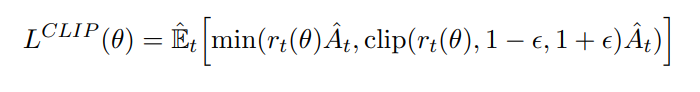

# PPO(Proximal Policy Optimization Algorithms)
기존 KL divergence로 계산하는 방식이 computation load가 커서 Clippig을 통해 개선한 Algorithm
  
학습 과정에서 가중치가 과하게 업데이트 되는것을 막기 위해서 사용됨

Actor-Critic 구조에서 활용되는 학습 방법론


기존 TRPO는 KL divergence를 활용해서 강한 규제를 사용하고, KL divergence를 구하는 과정 자체가 무거움



PPO는 위 식에서 처럼 ratio가 1-$ \epsilon$, 1+$\epsilon$을 넘어서면 clip을 수행함

$$
L(\theta) =

\begin{cases}
r(\theta)A_t & \text{if } r(\theta) \le 1+\epsilon \\

(1+\epsilon)A_t & \text{if } r(\theta) > 1+\epsilon
\end{cases}
$$

로 정리해서 다시 나타낼 수 있음  
2번짜 $L(\theta)$의 경우 식에 $\theta$가 없는 상수 term이 되어서 가중치 갱신 수행 안됨
  

$\min(\cdot)$의 필요성: min이 없을경우 adventage가 음수일때, 잘못된 방향으로 학습이 진행될때 피드백이 가능해짐.

$$
  r_t = \frac{\pi_\theta(a_t|s_t)}{\pi_{\theta old}(a_t|s_t)}
$$

ratio로 예전 정책과 현재 정책사이의 비율, Actor-Critic 에서 학습할때, Adventage를 구하는데 이떄 이전 정책과 현재정책을 비교하고 Adventage를 곱해서 얼마나 긍정적/부정적으로 변화하였는지를 Loss에 반영함.  
Adventage는 다양한 방법으로 구할 수 있음 (e.g. GAE)

ref(PPO): https://arxiv.org/pdf/1707.06347

## PPO
```py
class PPO(nn.Module):
    def __init__(self):
        super(PPO, self).__init__()
        self.data = []
        
        self.fc1   = nn.Linear(4,256)
        self.fc_pi = nn.Linear(256,2)
        self.fc_v  = nn.Linear(256,1)
        self.optimizer = optim.Adam(self.parameters(), lr=learning_rate)

    def pi(self, x, softmax_dim = 0):
        x = F.relu(self.fc1(x))
        x = self.fc_pi(x)
        prob = F.softmax(x, dim=softmax_dim)
        return prob
    
    def v(self, x):
        x = F.relu(self.fc1(x))
        v = self.fc_v(x)
        return v
```
Agent-Critic구조의 네트워크 구현부분

`def pi`에서 actor의 NN을 forward할 수 있도록 구현됨, 이 환경에서는 left,right로 제공됨

`def v`에서 critic NN을 forward할 수 있도록 구현함

```
    def put_data(self, transition):
        self.data.append(transition)
        
    def make_batch(self):
        s_lst, a_lst, r_lst, s_prime_lst, prob_a_lst, done_lst = [], [], [], [], [], []
        for transition in self.data:
            s, a, r, s_prime, prob_a, done = transition
            
            s_lst.append(s)
            a_lst.append([a])
            r_lst.append([r])
            s_prime_lst.append(s_prime)
            prob_a_lst.append([prob_a])
            done_mask = 0 if done else 1
            done_lst.append([done_mask])
            
        s,a,r,s_prime,done_mask, prob_a = torch.tensor(s_lst, dtype=torch.float), torch.tensor(a_lst), \
                                          torch.tensor(r_lst), torch.tensor(s_prime_lst, dtype=torch.float), \
                                          torch.tensor(done_lst, dtype=torch.float), torch.tensor(prob_a_lst)
        self.data = []
        return s, a, r, s_prime, done_mask, prob_a
```

해당 부분에서는 dqn에서 활용한 것 처럼 replay buffer를 둔 후 학습 단계에서 batch 학습 처럼 활용할 수 있게 남겨둠

dqn은 stochastic했다면 이 예제는 random sample이 아니라 `T_horizon`마다 update를 진행할 수 있도록 구현됨

```py
    def train_net(self):
        s, a, r, s_prime, done_mask, prob_a = self.make_batch()

        for i in range(K_epoch):
            td_target = r + gamma * self.v(s_prime) * done_mask
            delta = td_target - self.v(s)
            delta = delta.detach().numpy()

            advantage_lst = []
            advantage = 0.0
            for delta_t in delta[::-1]:
                advantage = gamma * lmbda * advantage + delta_t[0]
                advantage_lst.append([advantage])
            advantage_lst.reverse()
            advantage = torch.tensor(advantage_lst, dtype=torch.float)

            pi = self.pi(s, softmax_dim=1)
            pi_a = pi.gather(1,a)
            ratio = torch.exp(torch.log(pi_a) - torch.log(prob_a))  # a/b == exp(log(a)-log(b))

            surr1 = ratio * advantage
            surr2 = torch.clamp(ratio, 1-eps_clip, 1+eps_clip) * advantage
            loss = -torch.min(surr1, surr2) + F.smooth_l1_loss(self.v(s) , td_target.detach())

            self.optimizer.zero_grad()
            loss.mean().backward()
            self.optimizer.step()
```
PPO의 주요 구현부가 포함된 학습전략

make_batch함수를 통해 batch만큼의 결과로 가중치를 update(train)함 이 예제에서는 T_horizon만큼의 step이 지난 후 update 하는 구조로 구현됨
  
```py
            td_target = r + gamma * self.v(s_prime) * done_mask
            delta = td_target - self.v(s)
            delta = delta.detach().numpy()
```
TD학습에서 활용하는 target을 구해주는 부분, 다음 state에서 값을 받아서 현재 state일때의 critic 값을 빼고, 현재 reward를 더해서 delta를 구해줌

```py
            advantage_lst = []
            advantage = 0.0
            for delta_t in delta[::-1]:
                advantage = gamma * lmbda * advantage + delta_t[0] #GAE 계산부분
                advantage_lst.append([advantage])
            advantage_lst.reverse()
            advantage = torch.tensor(advantage_lst, dtype=torch.float)
```
GAE계산 부분
$$A_t^{GAE} = \delta_t + (\gamma \lambda)\delta_{t+1} + (\gamma \lambda)^2\delta_{t+2} + \dots$$
해당 식처럼 delta를 누적으로 곱해서 $A_t$를 계산해줌

이 방법을 통해 현재 업데이트 방향이 긍정적인지, 부정적인지 구분이 가능함

```py
            pi = self.pi(s, softmax_dim=1)
            pi_a = pi.gather(1,a)
            ratio = torch.exp(torch.log(pi_a) - torch.log(prob_a))  # a/b == exp(log(a)-log(b))
```

$$
  r_t = \frac{\pi_\theta(a_t|s_t)}{\pi_{\theta old}(a_t|s_t)}
$$
수식 부분 코드에서는 log와 exp를 활용해서 구현함.
  
`pi_a`의 경우 학습 과정에서 업데이트된 $\theta$를 반영한 결과값, `prob_a`의 경우 업데이트를 반영하지 않은 old한 행동 NN이 알려줬던 값(main에서 던져줌)

```py
            surr1 = ratio * advantage
            surr2 = torch.clamp(ratio, 1-eps_clip, 1+eps_clip) * advantage
            loss = -torch.min(surr1, surr2) + F.smooth_l1_loss(self.v(s) , td_target.detach())
```
PPO구현부, `clamp`를 통해 위에서 설명한 CLIP을 적용하여 KL divergence를 활용하지 않고도 안정적인 학습이 가능하도록 유도함

`min`을 통해 학습이 잘못 이루어졌을 경우의 안정장치 포함됨

`loss`는 PPO를 적용하는 값에 L1 norm으로 가치 함수도 업데이트 되도록 구현

## Main
```py
def main():
    env = gym.make('CartPole-v1')
    model = PPO()
    score = 0.0
    print_interval = 20

    for n_epi in range(10000):
        s, _ = env.reset()
        done = False
        while not done:
            for t in range(T_horizon):
                prob = model.pi(torch.from_numpy(s).float())
                m = Categorical(prob)
                a = m.sample().item()
                s_prime, r, done, truncated, info = env.step(a)

                model.put_data((s, a, r/100.0, s_prime, prob[a].item(), done))
                s = s_prime

                score += r
                if done:
                    break

            model.train_net()

        if n_epi%print_interval==0 and n_epi!=0:
            print("# of episode :{}, avg score : {:.1f}".format(n_epi, score/print_interval))
            score = 0.0
```
PPO를 활용한 actor-critic 모델 선언 후 확률에 따라 action을 sampling을 수행함.

```py
            for t in range(T_horizon):
```
에서 T_horizon 파라미터 값에 해당하는 time마다 train을 수행하도록 구현

```py
                prob = model.pi(torch.from_numpy(s).float())
                m = Categorical(prob)
                a = m.sample().item()
```
모델에서 정책에 따른 확률을 받고, 확률에 따라 action을 sampling할 수 있도록 구현


```py
                s_prime, r, done, truncated, info = env.step(a)

                model.put_data((s, a, r/100.0, s_prime, prob[a].item(), done))
                s = s_prime
```
action에 맞게 한 스텝을 진행하고, 그때의 값을 trajectory에 반영할 수 있도록 `put_data`함수를 통해 입력함

실패시 종료할수 있도록 `if done:`을 구성하고 한 에피소드가 끝나거나 t가 충분하면 모델을 학습시킴